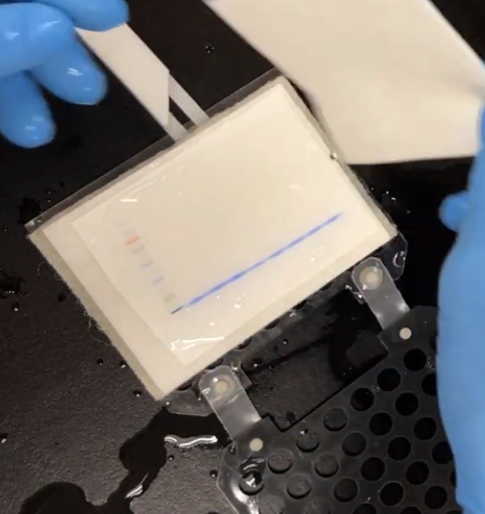
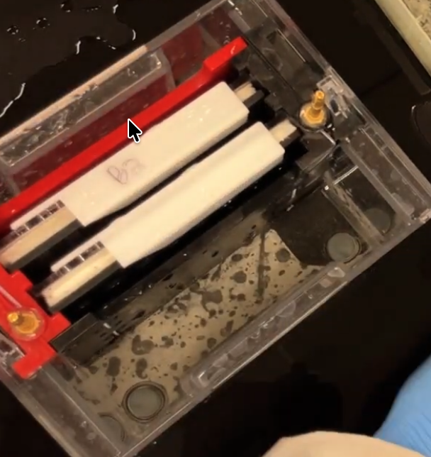

## Overview

Western blot detects a specific protein within a complex mixture. Proteins are separated by size via SDS-PAGE, transferred to a membrane, and probed with antibodies specific to the target protein.

**Mechanism:** Sodium dodecyl sulfate (SDS) denatures proteins and coats them with a uniform negative charge, so separation on the gel depends solely on molecular weight — smaller proteins migrate faster toward the positive electrode. After electrophoresis, proteins are electrophoretically transferred from the gel onto a PVDF membrane, then detected by sequential blocking, primary antibody, and secondary antibody incubations, followed by chemiluminescent imaging.

**Estimated timeline:**

| Stage                                                      | Time                                                                 |
| ---------------------------------------------------------- | -------------------------------------------------------------------- |
| Sample preparation (lysis)                                 | ~30–45 min                                                           |
| Gel electrophoresis                                        | ~1–1.25 h                                                            |
| Transfer                                                   | **~1.5–2 h** (⚠REVISED — extended for PTPRB's high MW/glycosylation) |
| Blocking                                                   | 1 h                                                                  |
| Primary antibody                                           | 1 h (RT) or overnight (4°C)                                          |
| Washes + secondary antibody                                | ~1.5–2 h                                                             |
| Loading control strip/reprobe (if reprobing same membrane) | +~1.5 h                                                              |
| Detection/imaging                                          | ~15 min - 1h                                                         |

**Equipment needed (not consumed):** SDS-PAGE gel tank and power supply, transfer apparatus (wet or semi-dry), PCR machine or heat block, tabletop centrifuge (4°C capable), sonicator, rocking platform, chemiluminescence imager, 

**Safety notes:**
- BME (2-mercaptoethanol) is a flammable, foul-smelling reducing agent — handle in a fume hood and keep in the flammable cabinet.
- Methanol (used for PVDF activation and in transfer buffer) is toxic and flammable — use in a ventilated area.
- Wear gloves throughout; SDS and acrylamide gels are irritants.

## Materials and Preparation

| Reagent                                                                | Cat#                                | Storage                                    |
| ---------------------------------------------------------------------- | ----------------------------------- | ------------------------------------------ |
| Cell lysis buffer                                                      | # 9803S                             | Aliquoted in small tubes, -20 storage room |
| Protease inhibitor                                                     | # PPC1010-1ML                       | -20°C, aliquoted                           |
| TGX gel                                                                | #4561095                            | 4°C fridge B, storage room, on the door    |
| Laemmli sample buffer                                                  | #1610737                            | DNA gel bench shelf                        |
| 2-mercaptoethanol (BME)                                                | # M3148-25mL                        | Flammable cabinet                          |
| Protein ladder (use a high-MW-range ladder, e.g. up to 250 kDa)        | #1610374                            | -20°C fridge B storage room                |
| 10x Running buffer                                                     | #1610732                            |                                            |
| PVDF membrane, **0.45 µm** for large protein, 0.2µm for normal protein | #1212781 (**0.45 µm**)  # T13087 | DNA gel bench shelf                        |
| Filter paper                                                           | #88600                              | DNA gel bench shelf                        |
| TBST                                                                   | # 9997S (or prepare, see below)     | Stock without tween20 on my shelf          |
| SuperSignal West Femto (20 µL)                                         | #34094                              | 4°C; Zhang lab is more gentle              |
| milk powder (zhang lab)                                                | aliquote                            | my shelf                                   |

**Antibody needed based on experiment**: primary and secondary (or directly conjugated primary)

| Antibody                    | Cat#               | Storage            |
| --------------------------- | ------------------ | ------------------ |
| Anti-PTPRB primary antibody | PA568309           | 4°C                |
| anti-rabbit-HRP             | 32460              | 4°C                |
| rat Anti-GAPDH              | zhang lab aliquote | 4°C box small tube |
| goat anti-rat               | zhang lab aliquote | 4°C box small tube |

**1x TBST (1 L):** 20 mM Tris, 150 mM NaCl, 0.05–**0.1%** Tween 20
(prepare without adding Tween20, since Tween-20 can support microbial growth)
- 20 mL 1 M Tris-HCl (pH 7.5)
- 8.77 g NaCl
- Bring to 1 L with water
- (1mL tween20 add last)

**0.5L of 10xTransfer buffer:** 
- Do not pH-adjust — buffer relies on the natural pH of this Tris/glycine mixture (~8.3); adding acid/base changes the buffering chemistry and is not standard practice.
- Store at room temperature or 4°C — stable for months without methanol added.

| Component     | Amount   | Final conc. in 10× |
| ------------- | -------- | ------------------ |
| Tris base     | 15 g     | 250 mM             |
| Glycine       | 72 g     | 1.92 M             |
| Distilled H₂O | to 0.5 L | —                  |
Making 1× Transfer Buffer (working solution, 25 mM Tris base, 192 mM glycine, 20% methanol (v/v), pH ~8.3)

| Component     | Amount             |
| ------------- | ------------------ |
| 10× stock     | 100 mL             |
| Methanol      | 200 mL (20% final) |
| Distilled H₂O | 700 mL             |
**Mix in this order:** stock + water first, then add methanol last, mixing as you go.

**1x running buffer (1 L):** 900 mL water + 100 mL 10x running buffer (#1610732)
**Blocking buffer** (5% milk): 10mL TBST +  0.5g
## 1. Sample Preparation
[[mcf7_protocols#Cell Lysis]]
1. Dilute 10x cell lysis buffer (#9803S) 1:10 in water (900 µL ddH2O + 100 µL 10x cell lysis buffer). Add protease inhibitor fresh, just before use.
2. Resuspend 10 million cells in 0.4 mL diluted lysis buffer. Incubate 10 min at 4°C with rocking, then sonicate to complete cell lysis (short pulses, keep on ice to avoid heat-induced protein degradation).
3. Spin down at 14,000 g for 5 min at 4°C to pellet insoluble material (membranes, DNA, debris). Transfer the supernatant to a fresh tube on ice — this is your lysate.
4. Determine protein concentration by Bradford or BCA assay so you can normalize loading across samples.
5. Storage: aliquot lysate (in loading buffer, if not needed immediately) and store at -80°C; avoid repeated freeze-thaw cycles, which degrade protein quality. If not using the same day, store the raw lysate at -80°C until ready. Thaw lysates quickly before use — prolonged time on ice shifts pH and can affect band quality. 
**Troubleshooting:** weak or absent signal downstream often traces back to this step — under-lysis, protein degradation from slow thawing, or inaccurate quantification.
## 2. Gel Loading and Electrophoresis
**Goal:** separate proteins by molecular weight. Proteins migrate from the negative electrode toward the positive electrode.
1. Prepare reducing sample buffer: 95 µL 2x Laemmli buffer (#1610737) + 5 µL BME (#M3148-25mL). BME reduces disulfide bonds, ensuring full denaturation.
	if using 4x Laemmli buffer, 47.5 µL 4x Laemmli buffer + 47.5µL water + 5 µL BME
2. Mix 10 µL sample buffer with 10 µL sample (20 µL total loading volume) to bring total protein to ~1–2 mg/mL. For the ladder, mix 10 µL Protein ladder (#1610374) with 10 µL sample buffer. 
	For PTPRB, total protein ~10mg/mL in 20uL loading sample
3. Denature samples at 95°C for 5 min in a PCR machine. No need for protein ladder to denature 
4. Assemble the gel cassette (TGX gel, #4561095, 4–20%):
	- Remove the comb and green tape from the gel.
	- Load two TGX cassettes with the shorter side of each gel facing inward.
	- Fill the inner chamber (between the two gels) with 1x running buffer, then fill the outer chamber to the 2-gel fill line.
5. Load samples 10µL
	(I used to load with 15µL, but there is always signal in the adjacent lane likely due to sample leakage)
	**30–50 µg** of lysate protein per well
	For a lower-abundance transmembrane protein PTPRB, I loaded ~**200ug** cell lysate
	load your loading-control target (GAPDH) from the same lysate aliquots into a separate lane
6. Run at constant voltage: 124 V, 72 mA. A 4–20% gradient gel. Run until the dye front nears the bottom (~1–1.25 h), which gives the high-MW region more separation time
	check bubbles forming after turning on the power
	While the gel runs, prepare **2 L** of transfer buffer (see recipe above)

**Troubleshooting:** smeared lanes usually indicate overloading or incomplete denaturation; a bowed ("smiley") gel front often means the voltage was too high or the gel ran too long.
## 3. Transfer to Membrane

**Goal:** electrophoretically move separated proteins from the gel onto a membrane for antibody probing.

**Materials:** SDS-PAGE gel, transfer apparatus, wash buffer (TBST), membrane — nitrocellulose or PVDF, methanol (for PVDF), filter paper (#88600).
[Youtube: gel transfer](https://www.youtube.com/watch?v=H-2ooRSlyp4)

3.1. Take out gel from cassette. Equilibrate everything in transfer buffer
3.2. Assemble the transfer "sandwich" in the cassette, from negative to positive electrode: white(+)sponge → filter paper → membrane →  gel → filter paper → sponge(-)black
following the youtube
- Gel closest to the negative electrode (black cassette).
- Membrane closest to the positive electrode.
- Roll out any air bubbles with a small roller — trapped bubbles cause blank spots on the membrane.
- cassette black side faces black electrode in the gel tank
- Place icebag into gel tank; Put the gel tank onto ice (ice fills big tray).

**Figure 1.** Assembly

**Figure 2.** gel tank

3.3. Run the transfer (electric field drives proteins from gel onto the membrane, gel side negative, membrane side positive). 
	100V and 200mA (constant voltage)
	extend transfer time to ~1.5–2 h (wet transfer) for PTPRB, since large, heavily glycosylated proteins move out of the gel more slowly than typical mid-size proteins; a standard 30–45 min transfer risks leaving most of your target behind in the gel. 
	Keep the apparatus cold (ice block or cold room) throughout, since heat buildup is more of a concern over this longer run.

3.4. Check transfer efficiency (while you are performing antibody staining):
- Coomassie-stain the post-transfer gel — it should be mostly clear of protein if transfer was efficient.
- Compare the pre-stained ladder on the gel vs. the membrane as a quick visual check that bands transferred.
- Note: Ponceau S staining is not recommended before fluorescent detection, since it can raise background fluorescence even after extensive washing — use a non-fluorescent alternative stain if fluorescent detection is planned. Ponceau S is fine as a quick, reversible check before chemiluminescent (HRP) detection.

**Troubleshooting:** little/no protein on the membrane suggests incomplete transfer (check assembly orientation and current); excess protein remaining on the gel after transfer suggests transfer time was too short or voltage too low.

## 4. Antibody Staining and Detection

**Goal:** specifically label the target protein and visualize it.

**Materials:** blocking buffer (3–5% milk or BSA in TBST), wash buffer (TBST), membrane, anti-PTPRB primary antibody, species-matched HRP secondary antibody, anti-GAPDH (loading control), SuperSignal West Femto (#34094).

4.1. Block the membrane in blocking buffer for 1 h at room temperature with gentle rocking, to prevent nonspecific antibody binding. 
	milk gives a better blocking
	check which the specific antibody's datasheet recommends, since some antibodies (e.g., phospho-specific) perform poorly with milk.

4.2. Dilute the anti-PTPRB primary antibody in blocking buffer (check the specific datasheet — starting dilutions for WB primaries commonly range 1:500–1:2000).
	PTPRB antibdoy -> 1:1000
	Goat anti-Rabbit IgG (H+L) HRP secondary -> 1:2000

4.3. Incubate the membrane with the primary antibody in blocking buffer, with gentle rocking — either **overnight at 4°C** (typically better signal-to-noise, and often needed for lower-abundance targets like PTPRB) or **1 h at room temperature** (faster, if time-limited).

4.4. Wash the membrane 3x with TBST, 5 min each, with rocking, to remove unbound antibody.

4.5. Incubate with the HRP-conjugated secondary antibody (species-matched to the anti-PTPRB primary's host, e.g. anti-rabbit-HRP or anti-mouse-HRP) in blocking buffer for 1 h at room temperature with gentle rocking, then repeat the 3x, 5 min TBST washes.

4.6. Prepare SuperSignal West Femto substrate (#34094) fresh (1:1 mix of the two components per manufacturer instructions), apply evenly across the membrane, and incubate ~1–5 min at room temperature, protected from light.
	- How ECL works: HRP catalyzes a reaction with the ECL substrate. The substrate contains **luminol** plus **hydrogen peroxid**. HRP oxidizes the luminol in the presence of peroxide, producing light as a byproduct. This light is captured by your chemiluminescence imager
	- Standard/Classic ECL is for Abundant targets (good fit for your **GAPDH**)
	- SuperSignal West Femto for Very low-abundance targets, needs careful short-exposure imaging

4.7. Image the membrane on a chemiluminescence imager. Start with a short exposure and increase as needed — Femto substrate is very sensitive and can saturate quickly.
	image at zhang lab: Zhang lab ECL reagent gives weaker signal
	select Chemiluminescence mode -> adjust capture time(start with 10s) -> once you see band, select cancel -> you can check in gallery (top left)
	select Colorimetric to take bright field -> select manual (4s) -> once finished, go to gallery to merge with Chemiluminescence image (by selecting both file and select "merge")

**Troubleshooting:**
- High background: increase wash stringency (more washes, longer washes, or add up to 0.1% Tween-20), or dilute the antibody further.
- Multiple/nonspecific bands: increase antibody dilution, extend blocking time, or confirm antibody specificity against the target 
